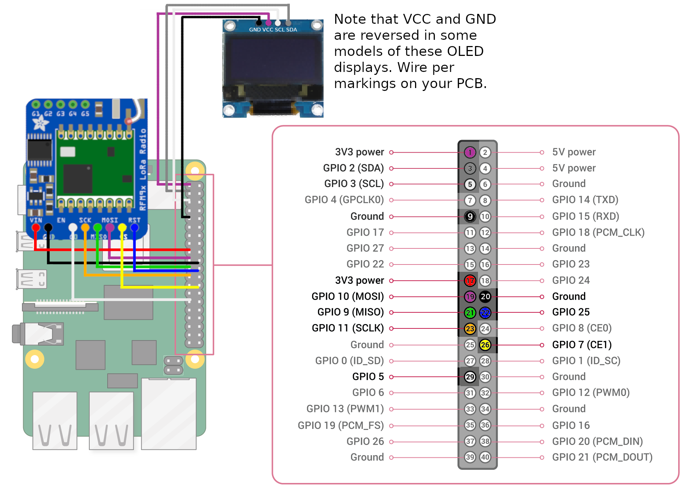

# Long distance file transfer with lora packet radio
This is a senior design project with the goal of sending files large distances using LoRa. 
The hardware consists of a Raspberry Pi 3 B+ and an Adafruit RFM95 Lora Radio. 

**Status**
The project is currently in the prototype and testing stage. See the How To Use Section below.

**Setup**
This project uses the Adafruit RFM9x circuit python library. Before installing this library, circuit python must be installed.

1. Installing Circuit Python  
See [Adafruit Installing Circuit Python](https://learn.adafruit.com/circuitpython-on-raspberrypi-linux/installing-circuitpython-on-raspberry-pi)

2. Install RFM9x adafruit library  
The installation process for the RFM9x can be found at [here.](https://learn.adafruit.com/lora-and-lorawan-radio-for-raspberry-pi/raspberry-pi-wiring)

**Testing**
Run the example code "test-2.py" from "tests" in the repository

**How To Use**  
1. Go to the "Prototype" directory in the depository
2. Copy the "interface.py" and "sendfile.py" into a new directory on your raspberry pi
3. In the same directory, create "rx_dir" and "tx_dir" directories
4. Copy the contents of "rx_dir" and tx_dir" from "Prototype" on the respository to the "rx_dir" and "tx_dir" on your raspberry pi. 
5. To send a file, run "sendfile.py" by entering "python3 sendfile.py" into the command line on two Pis. Enter "1" for RX mode on one pi and "2" for TX mode on the other. Then TX mode should list the files in your tx_dir with a number. Enter the number next to the file you want to send. The RX Pi will constantly say "waiting for packet" every 5 seconds until TX mode sends a packet. If the file send is successeful, then the contents should be written to "rfile.txt" in the rx_dir of RX mode.  
6. To send a list of files from one device to another and ask the device what file it wants, run "intefrace.py" on two Pis. Whichever pi sends its files first will act as the sender and the other as the receiver. The reciever sholud recieve the files in the tx_dir of the sender. On the receiver, enter the file you want. The sender should then send that file. If the file sends successfully, then the reciever should write its contents to "rfile.txt" in the rx_dir. 

**Examples from other sources**
This Guide is for an example project for getting started with LoRa and raspberry pi. 
For more info about the RFM9x python library, see [Adafruit_CircuitPython_RFM9x.](https://github.com/adafruit/Adafruit_CircuitPython_RFM9x) and [Circuit Python's Documentation.](https://circuitpython.readthedocs.io/projects/rfm9x/en/latest/index.html)

**Wiring guide:** 

